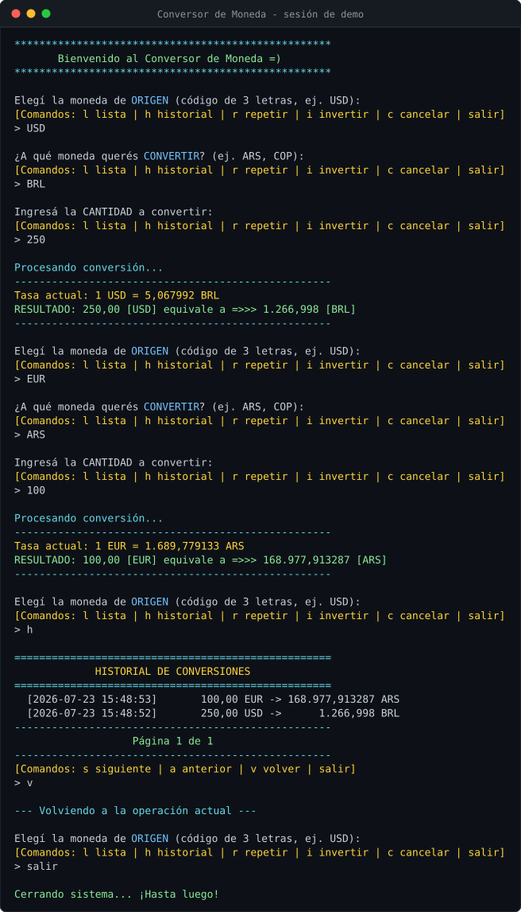

# Conversor de Monedas

[](https://github.com/Neo236/Conversor-de-Moneda-Challenge-ONE/actions/workflows/ci.yml)

Aplicación de consola en Java que convierte divisas con la cotización del momento, contra la
[ExchangeRate-API](https://www.exchangerate-api.com/). Elegís las monedas y la cantidad, y te
da el resultado y la tasa; cada conversión queda en un historial que persiste entre sesiones,
y los comandos (lista, historial, repetir, cancelar, salir) responden en cualquier momento
sin perder la operación en curso. No hace falta registrarse en ningún lado: sin API key la
app usa las tasas del día del endpoint abierto de la misma API.

Salió del challenge de **Alura Latam** (programa Oracle Next Education).



**[Ver la demo en vivo →](https://neo236.github.io/Conversor-de-Moneda-Challenge-ONE/)**

La demo reproduce una sesión completa —tecleo incluido— con las tasas del día, sin instalar
nada.

## Qué hace

- Convierte entre más de 150 monedas con la cotización del momento.
- Funciona con o sin API key: sin ella usa las tasas del día (cortesía de
  [Rates By Exchange Rate API](https://www.exchangerate-api.com)); con tu clave usás tu
  propia cuota y la frecuencia de actualización de tu plan.
- Comandos globales: lista, historial, repetir, invertir, cancelar o salir en cualquier
  momento, sin perder la operación en curso.
- Lista de monedas paginada y con búsqueda por código o nombre (`b`).
- Historial persistente: cada conversión se guarda en `historial.json` con su fecha y se
  navega paginado, de la más reciente a la más vieja.
- Montos como se leen en es-AR (`101.050,00`), entrada con coma decimal, y `100.000` a
  secas se rechaza con un aviso en vez de adivinar si eran cien mil o cien.
- Los colores se apagan solos donde no se verían (salida redirigida, `NO_COLOR`,
  terminales sin ANSI), o a mano con `--no-color`.

## Cómo ejecutarlo

Ningún camino exige registrarse: sin clave, la app sigue con las tasas del día. Con una
API Key propia (gratis en [exchangerate-api.com](https://www.exchangerate-api.com/)) usás
tu cuota y la frecuencia de tu plan; se pasa por la variable de entorno
`EXCHANGE_RATE_API_KEY` (o se teclea al arrancar: queda solo en memoria, nunca se escribe
a disco ni aparece en los logs).

**Con el jar del release — solo hace falta Java 21 o más nuevo.** Bajá `conversor.jar` del
[último release](https://github.com/Neo236/Conversor-de-Moneda-Challenge-ONE/releases/latest) y:

```bash
java -jar conversor.jar
```

**Con Docker, sin instalar Java.**

```bash
docker run -it --rm ghcr.io/neo236/conversor-de-moneda-challenge-one
```

También se puede buildear la imagen local con `docker compose run --rm conversor` (se usa
`run` y no `up` porque el menú se maneja por teclado).

**Desde el código.** Alcanza con tener algún JDK: el wrapper baja Gradle y el toolchain
baja el JDK 21 si el tuyo es otro.

```bash
./gradlew run
```

En Windows es `.\gradlew run` (PowerShell) o `gradlew run` (cmd). Para fijar la clave,
según tu shell:

```bash
export EXCHANGE_RATE_API_KEY="tu_clave"    # bash / zsh
$env:EXCHANGE_RATE_API_KEY = "tu_clave"    # PowerShell
set EXCHANGE_RATE_API_KEY=tu_clave         # cmd
```

Para armar una distribución con su script de arranque: `./gradlew installDist` y después
`./build/install/conversor/bin/conversor`. El fat-jar sale con `./gradlew shadowJar`.

## Comandos

| En cualquier momento | |
| --- | --- |
| `l` / `lista` | Abre la lista de monedas |
| `h` / `historial` | Abre el historial de conversiones |
| `r` / `repetir` | Repite la última conversión con la cotización del momento |
| `i` / `invertir` | Convierte el último resultado de vuelta |
| `c` / `cancelar` | Aborta la operación en curso y vuelve al inicio |
| `salir` | Termina el programa (también adentro de las listas) |

| Dentro de una lista | |
| --- | --- |
| `s` / `siguiente` | Página siguiente |
| `a` / `anterior` | Página anterior |
| `b` / `buscar` | Filtra por término (solo en la lista de monedas) |
| `v` / `volver` | Vuelve a donde estabas |

## Tests

```bash
./gradlew test
```

78 tests, sin tocar la red: el `HttpClient` entra por constructor, así que las respuestas de
la API están simuladas, y la interfaz se ejercita con un teclado y una salida de mentira.

## Estructura

```
com.alura.conversor
├── Main.java        Punto de entrada: arma las piezas
├── api/             Clientes de ExchangeRate-API (con clave y abierto) y sus respuestas
├── historial/       Persistencia del historial en JSON
└── ui/              Consola, paginador y flujo de la aplicación
```

## Decisiones de diseño

**Sin API key la app no se vuelve un cascarón.** El modo sin clave usa el endpoint abierto
de la misma ExchangeRate-API (tasas del día, atribución mediante) y calcula la conversión
localmente; los nombres de las monedas los pone el JDK (`java.util.Currency`), en español.
Registrarse suma cuota propia y planes con más frescura, pero no es la barrera de entrada.

**La plata es `BigDecimal`, no `double`.** No es purismo: con `double`, convertir 10.000.000
armaba la URL `/pair/USD/ARS/1.0E7` —porque así serializa Java un double grande— y la API
devolvía 404. El mismo cambio que arregla la precisión arregla el bug: `toPlainString()`.

**La entrada no adivina montos.** `10,50` vale diez con cincuenta y `1.234,56` vale mil
doscientos treinta y cuatro con cincuenta y seis —la coma desambigua—, pero `100.000` a
secas se rechaza con un aviso: leerlo como cien con tres decimales convertiría en silencio
un monto distinto al pedido.

**Los errores se leen del cuerpo, no del código HTTP.** ExchangeRate-API responde 200 con
`result: "error"` cuando el código de moneda no existe, y 403 con `error-type: invalid-key`
cuando la clave está mal. Mirar solo el status daría "error 403" cuando se puede decir "la API
Key no es válida".

**Los colores se ganan, no se imponen.** Los ANSI solo se emiten si la terminal los va a
mostrar como colores: con la salida redirigida, `NO_COLOR` definido o un Windows sin
procesamiento VT, el texto sale limpio en vez de rodeado de escapes.

**Los logs no van a la consola.** La pantalla es de la interfaz ANSI; el log va a
`logs/conversor.log`. Antes cada conversión imprimía sus líneas de log en medio de la interfaz.

**Un historial corrupto no impide arrancar.** Se carga desde el constructor, así que un JSON
inválido tiraba la aplicación abajo antes de mostrar el menú. Ahora se avisa por el log y se
empieza uno nuevo.

**Hay un solo paginador.** La lista de monedas y el historial tenían cada uno su bucle:
cuarenta líneas casi calcadas con los mismos comandos. `Paginador<T>` es ese bucle, una sola
vez.

**La entrada estándar se puede cerrar.** Con Ctrl+D o una tubería que termina,
`Scanner.nextLine()` lanza `NoSuchElementException`; antes eso escapaba de `main` y le mostraba
un stack trace al usuario. Ahora la aplicación cierra ordenadamente.

## Tecnologías

Java 21 · Gradle · `java.net.http.HttpClient` · Gson · SLF4J + Logback · JUnit 5 · Mockito · Docker

---

Hecho por Lautaro Sebastian Mambrin (Neo236).
